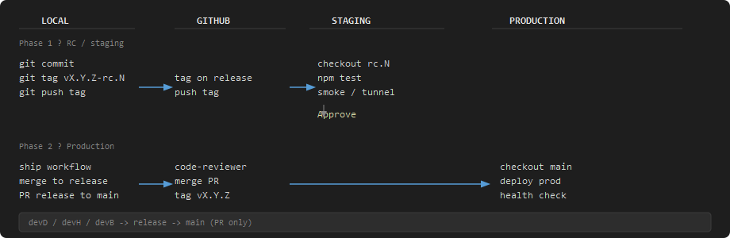

# Deploy Workflow — Local → Staging → Prod

> *"Code chưa chạy ổn trên staging thì không lên production."*

Hai môi trường triển khai chính: **Staging** (nhánh `release`, tag RC) và **Production** (nhánh `main`, tag `vX.Y.Z`).
Quy tắc Git chi tiết: `07_DEVELOPMENT_RULES.md` · Thực thi ship: `.agents/skills/ship-code/SKILL.md`.

## Flow Overview



<details>
<summary>ASCII (monospace — khi không xem được ảnh)</summary>

```txt
 LOCAL                  GITHUB                 STAGING                PRODUCTION
 -------                -------                -------                ----------

 git commit             tag on release         checkout rc.N
 git tag vX.Y.Z-rc.N    push tag ───────────>  npm test
 git push tag                                  smoke / tunnel
                                               |
                                               v
                                          🖐 Approve
                                               |
                                               v
                                          (RC passed)

 ship workflow          code-reviewer
 merge → release   ───> PR release → main ─────────────────────────> checkout main
 PR release → main      merge + tag                                  deploy prod
                        tag vX.Y.Z                                   health check
                                                                     GitHub Release
```

</details>

## Giải thích từng cột

| Cột | Vai trò | Hành động chính |
|-----|---------|-----------------|
| **LOCAL** | Máy dev (`devD` / `devH` / `devB`) | Commit, tag RC, chạy ship workflow |
| **GITHUB** | Remote + CI policy | Push tag, review, merge PR, tag release |
| **STAGING** | `release` + `vX.Y.Z-rc.N` | Test, smoke, tunnel (nếu có) |
| **PRODUCTION** | `main` + `vX.Y.Z` | Deploy sau khi PR merge |

## Phase 1 — RC / Staging

1. Commit trên nhánh dev.
2. Tạo tag `vX.Y.Z-rc.N` từ `release` (hoặc nhánh tích hợp đã merge).
3. Push tag lên GitHub.
4. Checkout RC trên staging → `npm test`, smoke test.
5. **Approve** thủ công trước khi mở PR lên `main`.

## Phase 2 — Production

1. Chạy ship workflow: github-release → code-reviewer → cập nhật `CHANGELOG.md`.
2. Merge dev → `release`, push.
3. Tạo PR `release` → `main`, merge sau khi review pass.
4. Tag `vX.Y.Z` trên `main`, publish GitHub Release.
5. Deploy production + health check.

## Lệnh tham khảo (PowerShell)

```powershell
# RC tag (staging)
git tag v1.2.0-rc.1
git push origin v1.2.0-rc.1

# Sau merge PR release → main
git checkout main
git pull origin main
git tag v1.2.0 <merge-commit-sha>
git push origin v1.2.0
gh release create v1.2.0 --notes-file CHANGELOG_SNIPPET.md
```

## Tài liệu liên quan

| File | Nội dung |
|------|----------|
| `07_DEVELOPMENT_RULES.md` | Push vs ship, nhánh Git |
| `.agents/skills/ship-code/SKILL.md` | Pipeline ship đầy đủ |
| `.agents/skills/push-code/SKILL.md` | Chỉ lưu code lên remote (không release) |
