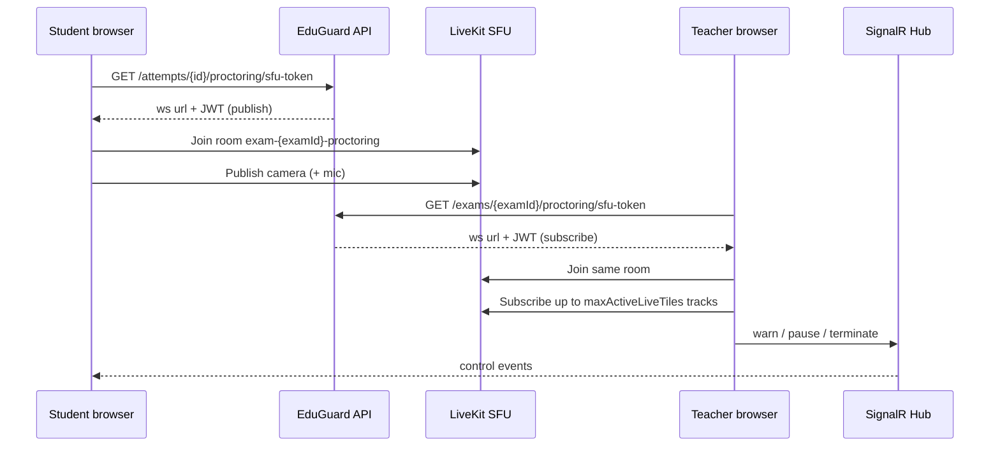

# Proctoring SFU (LiveKit) — cài đặt & kiểm thử

> **Mục đích:** Multi-stream giám sát (Google Meet style) qua SFU thay vì WebRTC P2P 1-1.  
> **Stack:** [LiveKit](https://livekit.io/) self-host + ASP.NET Core token API + React `livekit-client`.  
> **SignalR:** Giữ cho control events (warn / pause / terminate); media đi qua LiveKit.

## 1. Hiện trạng TURN/STUN trong repo

| Thành phần | Trạng thái | Ghi chú |
|------------|-----------|---------|
| STUN Google | **Có** | Mặc định `stun:stun.l.google.com:19302` trong `appsettings.json` → `WebRtc:IceServers` |
| TURN (coturn) | **Chưa cài** | Chỉ có hướng dẫn trong `docs/proctoring-webrtc-nat.md` và mẫu comment trong `infra/livekit/docker-compose.yml` |
| SFU LiveKit | **Mới thêm** | Docker `infra/livekit/`, bật qua `LiveKit:Enabled` |
| API ICE | `GET /api/proctoring/webrtc-config` | Trả `iceServers` cho P2P fallback |
| API SFU | `GET /api/proctoring/sfu-config` | `enabled`, `url`, `iceServers` |
| Token GV | `GET /api/exams/{examId}/proctoring/sfu-token` | Subscribe-only |
| Token SV | `GET /api/attempts/{attemptId}/proctoring/sfu-token` | Publish-only |

### Khi nào cần TURN

- Dev local (cùng máy / LAN): STUN + LiveKit local thường đủ.
- GV và SV khác mạng / symmetric NAT: **bật TURN** (coturn hoặc LiveKit built-in TURN) và thêm vào `WebRtc:IceServers`.

## 2. Vì sao chọn LiveKit (Option B)

| Tiêu chí | LiveKit | mediasoup | P2P hiện tại |
|----------|---------|-----------|--------------|
| Multi-subscribe GV | Native | Cần tự build room logic | 1 stream / 1 PC |
| SDK React + .NET token | Có | Chủ yếu Node | N/A |
| Self-host Docker | 1 container | Nhiều worker | Không cần |
| Tích hợp TURN | Có (config) / coturn riêng | Tự gắn | `WebRtc:IceServers` |

## 3. Chạy LiveKit local (Docker)

> **Lưu ý:** Phải chạy từ `infra/livekit` — chạy từ `infra/` sẽ lỗi `no configuration file provided: not found`.

```powershell
Set-Location D:\Projects\EduGuard\infra\livekit
docker compose up -d
```

Kiểm tra:

```powershell
curl http://localhost:7880
```

WebSocket URL mặc định: `ws://localhost:7880`  
Dev API key / secret (trong `livekit.yaml`): `devkey` / `secret`

## 4. Cấu hình backend

### `appsettings.json` (production template)

```json
"WebRtc": {
  "IceServers": [
    { "Urls": [ "stun:stun.l.google.com:19302" ] }
  ]
},
"LiveKit": {
  "Enabled": true,
  "Url": "ws://localhost:7880",
  "ApiKey": "devkey",
  "ApiSecret": "eduguard-dev-livekit-secret",
  "TokenTtlSeconds": 3600,
  "RoomPrefix": "exam-",
  "RoomSuffix": "-proctoring"
}
```

### `appsettings.Development.json` (đã bật SFU local)

```json
"LiveKit": {
  "Enabled": true,
  "Url": "ws://localhost:7880",
  "ApiKey": "devkey",
  "ApiSecret": "eduguard-dev-livekit-secret"
}
```

### Biến môi trường (gợi ý production)

```powershell
$env:LiveKit__Enabled = "true"
$env:LiveKit__Url = "wss://livekit.your-domain.com"
$env:LiveKit__ApiKey = "YOUR_API_KEY"
$env:LiveKit__ApiSecret = "YOUR_API_SECRET"
$env:WebRtc__IceServers__1__Urls__0 = "turn:turn.your-domain.com:3478"
$env:WebRtc__IceServers__1__Urls__1 = "turns:turn.your-domain.com:5349"
$env:WebRtc__IceServers__1__Username = "eduguard"
$env:WebRtc__IceServers__1__Credential = "REPLACE_TURN_SECRET"
```

> Không commit secret TURN/LiveKit vào repo — dùng User Secrets hoặc secret store.

### TURN với coturn (tùy chọn)

Bỏ comment service `coturn` trong `infra/livekit/docker-compose.yml`, thay `REPLACE_TURN_SECRET`, rồi thêm ICE server vào `WebRtc:IceServers` như trên.

Chi tiết thêm: `docs/proctoring-webrtc-nat.md`.

## 5. Luồng kết nối



**Room naming:** `exam-{examId}-proctoring`  
**Identity:** `attempt-{attemptId}` (SV), `teacher-{userId}` (GV)

**Fallback:** `LiveKit:Enabled=false` → client dùng WebRTC P2P qua SignalR như trước.

## 6. Kiểm thử dev (tài khoản `docs/DEV_LOGIN_ACCOUNTS.md`)

1. Start LiveKit: `docker compose up -d` trong `infra/livekit`
2. Start backend + frontend (`localhost:5157`, `localhost:5173`)
3. **teacher1@eduguard.test** — tạo/mở đề có live proctoring, publish
4. **student1@eduguard.test** — lobby → device check → làm bài (camera bật)
5. GV mở `/teacher/exams/{examId}/proctoring` — grid hiển thị nhiều tile live (tối đa `maxActiveLiveTiles`, mặc định 9)
6. **Admin** (`admin@eduguard.test`) — cùng phòng qua `/admin/exams/{examId}/proctoring` (API/hub/LiveKit token đã cho phép role Admin)
7. DevTools → Network: WS tới `localhost:7880`; API `sfu-config` trả `enabled: true`

### Xác nhận SFU hoạt động

- Nhiều SV in-progress → GV thấy video trên nhiều tile cùng lúc (không cần bấm từng tile để P2P)
- Chrome `chrome://webrtc-internals` — candidate type `relay` khi dùng TURN

### Tắt SFU (test P2P fallback)

Đặt `LiveKit:Enabled: false` trong `appsettings.Development.json`, restart API.

## 7. Việc còn lại (follow-up)

- [ ] Production TLS: `wss://` LiveKit + reverse proxy (nginx/Caddy)
- [ ] LiveKit embedded TURN hoặc coturn production với credential rotation
- [ ] Redis lock watch session: với SFU multi-tile, có thể nới policy “1 GV / 1 SV” nếu cần
- [ ] Egress/recording qua LiveKit (thay clip client-side)
- [ ] Health check LiveKit trong deploy pipeline

## 8. File liên quan

| File | Vai trò |
|------|---------|
| `infra/livekit/docker-compose.yml` | Chạy LiveKit local |
| `backend/.../live-kit-options.cs` | Cấu hình SFU |
| `backend/.../live-kit-token-service.cs` | JWT token |
| `frontend/.../useTeacherSfuViewer.js` | GV multi-subscribe |
| `frontend/.../useStudentSfuPublisher.js` | SV publish |
| `docs/proctoring-webrtc-nat.md` | STUN/TURN P2P & ICE |
